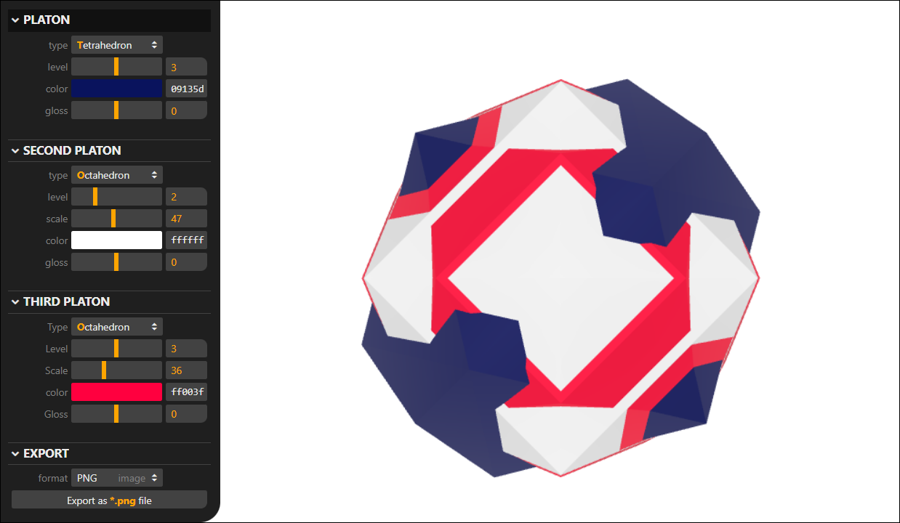

# Platons

**Platons** are 3D shapes made of overlapping Platonic solids and their
derivatives. They can be used as 3D avatars or in demo scenes instead of cubes
and spheres. This repository contains an online tool to generate
platons and save them as images, 3D models or web pages with Three.js code.

### [Online PLATONS Generator](index.html)

**License**

**Platons** operates within the scope of **GPL-3.0 license**. Platons that are
generated with the online tool can be used without restriction &ndash; i.e. they
can be modified, incorporated in non-open software, etc. However, no combination
of platonic shapes can be copyrighted and/or owned by anyone, so that the same
combination could be freely and independently generated by other people and used
by them under the same agreement.

