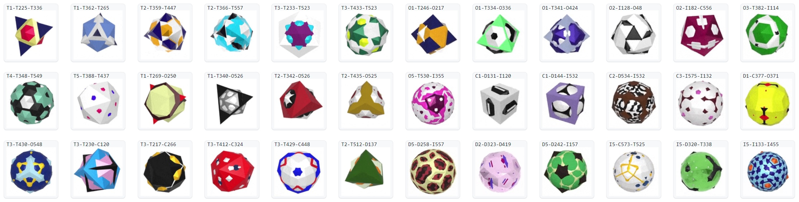

# Platons

**Platons** are 3D shapes made of overlapping Platonic solids and their derivatives.
They can be used as 3D avatars or in demo scenes instead of cubes and spheres.
Platons look like these:

[Generator](https://boytchev.github.io/platons/online/)  &middot; [Gallery](https://boytchev.github.io/platons/gallery/) &middot; [More info](https://boytchev.github.io/platons/)

### License
**Platons** operates within the scope of **modified GPL-3.0 license** [ [Details](index.md#license) ]. 

