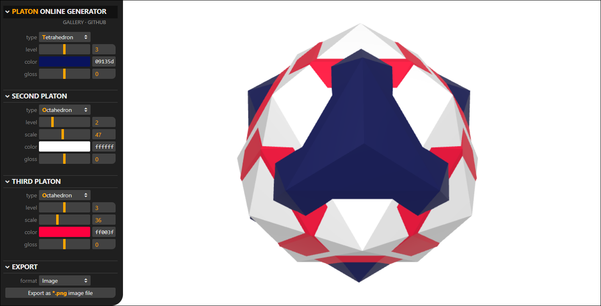

# Platons

**Platons** are 3D shapes made of overlapping Platonic solids and their derivatives.
They can be used as 3D avatars or in demo scenes instead of cubes and spheres.
This repository contains an online tool to generate platons and save them as
images, 3D models or web pages with Three.js code.

### Launch [[Online PLATONS Generator](https://boytchev.github.io/platons/online/)]

### Architecture

A platon consists of three overlapping Platonic solids. Each solid is defined by:

* **`TYPE`** of the Platonic solid that is used as a base type &nbsp; tetrahedron,
	octahedron, hexahedron (aka cube), dodecahedron or icosahedron.
* **`LEVEL`** of subdivisions of the solid, where level 1 is the original
	solid, each next level increases the complexity of the solid.
* **`SCALE`** in respect to the base Platonic solid. The scale is relative and
	defines how much a solid protrudes fromwithin the base solid.
* **`COLOR`** of the Platonic solid.
* **`GLOSS`** factor of the Platonic surface.

### Import

**Platons** may generate preset platon, provided as query string.

?g=C1-O233-I336&m=6ff0000-3ffff00-4ff

### Export

A platon generated with the online tool can be exported in several formats:

* as a **PNG image** containing a cropped snapshot of the platon as it appears on the screen.
* as a **3D model** in GLB/GLTF format, compatible with many 3D authoring software tools.
* as a **web page** in HTML format that can be directly opened by a browser.
* as a **JS module** in JS file that can be imported in used program.

### License
**Platons** operates within the scope of **GPL-3.0 license**.
Platons that are generated with the online tool can be used
without restriction &ndash; i.e. they can be modified or
incorporated in non-open software. However, no combination
of platonic shapes can be copyrighted and/or owned by anyone.
The same combination could be freely and independently
generated by other people and used by them under the same
agreement.

