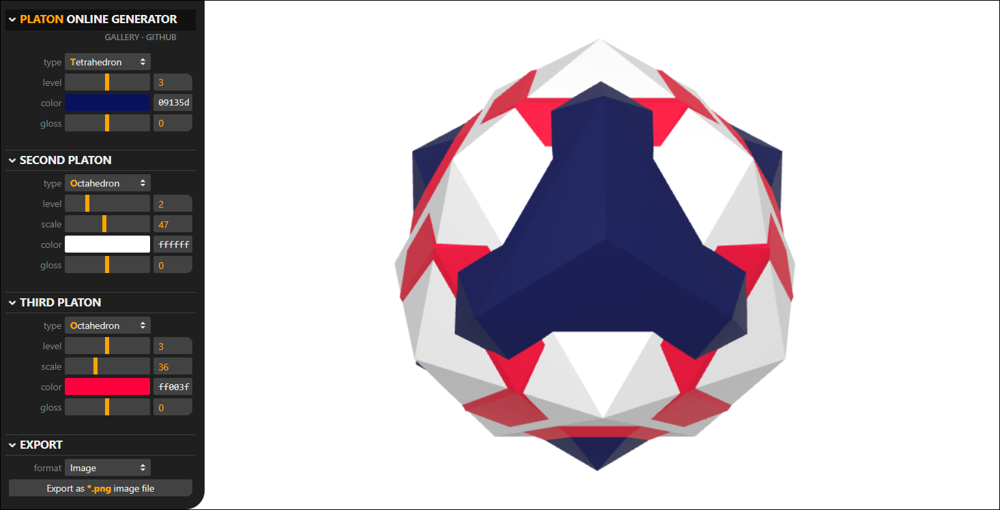

**Platons** are 3D shapes made of overlapping Platonic solids and their derivatives.
They can be used as 3D avatars or in demo scenes instead of cubes and spheres.
This repository contains an online tool to generate platons and save them as
images, 3D models or even web pages with Three.js code. The tool is made in
[Three.js](https://threejs.org/).

### [PLATON ONLINE GENERATOR](https://boytchev.github.io/platons/online/)

### [PLATON ONLINE GALLERY](https://boytchev.github.io/platons/gallery/)

### Architecture

A platon consists of three overlapping Platonic solids. Each solid is defined by:

* **`TYPE`** of the Platonic solid that is used as a base type &ndash; tetrahedron,
	octahedron, hexahedron (aka cube), dodecahedron or icosahedron.
* **`LEVEL`** of subdivisions of the solid, where level 1 is the original
	solid, each next level increases the complexity of the solid.
* **`SCALE`** in respect to the base Platonic solid. The scale is relative and
	defines how much a solid protrudes fromwithin the base solid.
* **`COLOR`** of the Platonic solid.
* **`GLOSS`** factor of the Platonic surface.

### Export

A platon generated with the online tool can be exported in several formats:

* **PNG image** of a cropped snapshot of the platon as it appears on the screen
* **3D model** in a GLB file, compatible with many 3D authoring software tools
* **Web page** as a standalone HTML file that can be directly opened by a browser
* **JS module** with platon class that can be imported in a JavaScript program
* **URL link** copied in the clipboard, describing platon's geometry and material

### License
**Platons** operates within the scope of **GPL-3.0 license**. Platons that are
generated with the online tool can be used without restriction &ndash; i.e. they
can be modified or incorporated in non-open software. However, no combination of
platonic shapes can be copyrighted and/or owned by anyone. The same combination
could be freely and independently generated by other people and used by them
under the same agreement.

